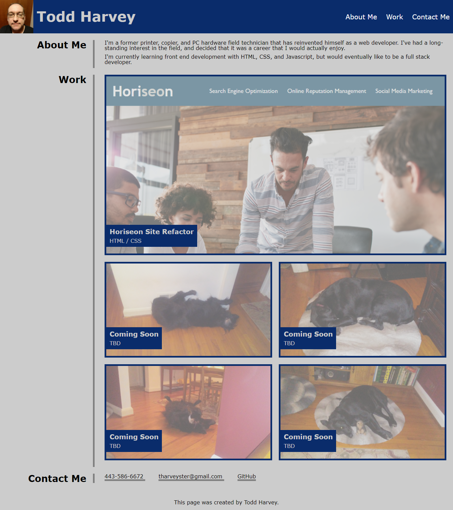

# Todd Harvey's Portfolio

## Description

In this project, I created a portfolio to display my completed web development projects.

The navigation links in the header scroll the page to the appropriate sections.

The most recent project is shown first, and is shown larger than the rest.

The page is responsive, and portions of the page (```<header>```, ```<nav>```, the projects in the "Work" section, and the contact methods in the "Contact Me" section) move or resize to adjust to a smaller display size.

The images for the projects are initially semi-opaque, but transition to fully opaque when hovered over.

## Page Link
The project can be viewed at <https://tharveyster.github.io/todd-harvey-portfolio/>.

## Screenshot
